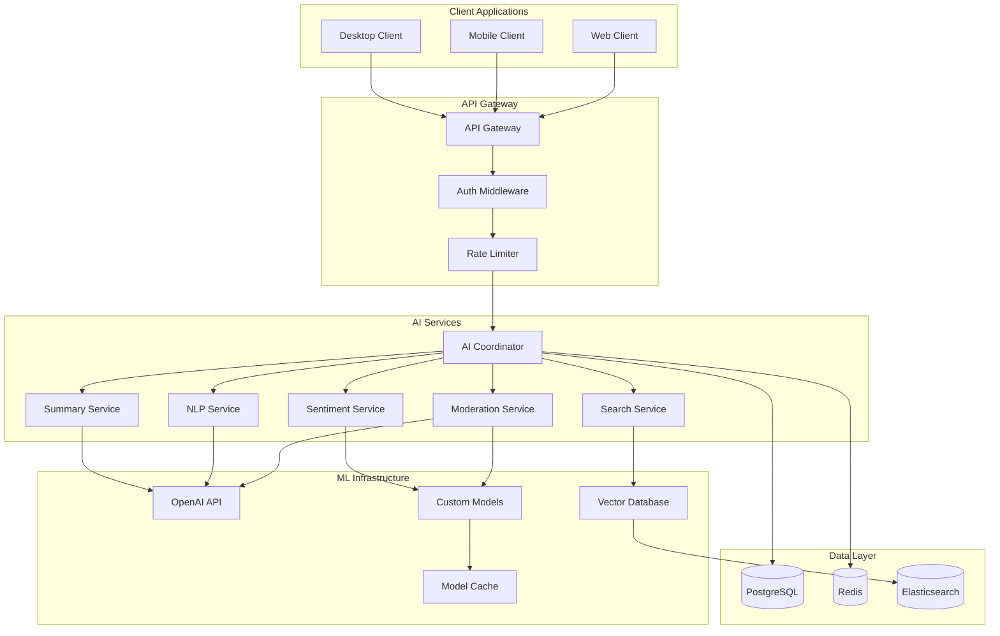

# AI Integration Strategy

## Overview

Enrichment integrates AI capabilities throughout the platform to enhance user experience, improve community management, and provide intelligent features. The AI strategy focuses on practical applications that add real value while maintaining user privacy and control.

## AI Architecture

### Service Architecture



## Core AI Features

### 1. Content Moderation

#### Automated Content Filtering
- **Real-time Analysis**: Process messages as they're sent
- **Multi-layer Detection**: Spam, toxicity, harassment, NSFW content
- **Context Awareness**: Consider server rules and community standards
- **False Positive Reduction**: Human-in-the-loop feedback system

**Implementation:**
```python
class ContentModerationService:
    def __init__(self):
        self.openai_client = OpenAI()
        self.custom_classifier = load_model('toxicity_classifier_v2')
        self.spam_detector = load_model('spam_detector_v1')
    
    async def moderate_content(self, content: str, context: dict) -> ModerationResult:
        # Multi-stage moderation pipeline
        results = await asyncio.gather(
            self.check_spam(content),
            self.check_toxicity(content),
            self.check_openai_moderation(content),
            self.check_server_rules(content, context)
        )
        
        return self.aggregate_results(results, context)
    
    async def check_toxicity(self, content: str) -> float:
        # Custom toxicity model
        features = self.extract_features(content)
        toxicity_score = self.custom_classifier.predict(features)
        return toxicity_score
    
    async def check_openai_moderation(self, content: str) -> dict:
        response = await self.openai_client.moderations.create(
            input=content
        )
        return response.results[0]
```

#### Smart Moderation Actions
- **Graduated Responses**: Warning → Timeout → Kick → Ban
- **Context-Sensitive**: Different thresholds for different channels
- **Appeal System**: Users can contest moderation decisions
- **Moderator Assistance**: Flag content for human review

### 2. Intelligent Search

#### Semantic Search
- **Natural Language Queries**: "Find discussions about React hooks"
- **Context Understanding**: Search within conversation context
- **Multi-modal Search**: Text, images, files, and voice messages
- **Personalized Results**: Relevance based on user activity

**Implementation:**
```python
class IntelligentSearchService:
    def __init__(self):
        self.embedding_model = SentenceTransformer('all-MiniLM-L6-v2')
        self.vector_store = ChromaDB()
        self.reranker = CrossEncoder('cross-encoder/ms-marco-MiniLM-L-6-v2')
    
    async def search_messages(self, query: str, context: SearchContext) -> SearchResults:
        # Generate query embedding
        query_embedding = self.embedding_model.encode(query)
        
        # Vector similarity search
        candidates = await self.vector_store.similarity_search(
            query_embedding,
            filter=self.build_filters(context),
            k=100
        )
        
        # Rerank results for relevance
        reranked = self.reranker.rank(query, candidates)
        
        # Apply permissions and formatting
        return self.format_results(reranked, context)
    
    async def index_message(self, message: Message):
        # Extract text content
        content = self.extract_searchable_content(message)
        
        # Generate embeddings
        embedding = self.embedding_model.encode(content)
        
        # Store in vector database
        await self.vector_store.add_document(
            id=message.id,
            embedding=embedding,
            metadata={
                'channel_id': message.channel_id,
                'server_id': message.server_id,
                'author_id': message.author_id,
                'timestamp': message.timestamp,
                'content': content
            }
        )
```

### 3. Conversation Intelligence

#### Automatic Summarization
- **Daily Summaries**: Key points from active channels
- **Thread Summaries**: Condensed view of long discussions
- **Meeting Notes**: Extract action items and decisions
- **Highlight Detection**: Important announcements and updates

**Implementation:**
```python
class ConversationSummaryService:
    def __init__(self):
        self.openai_client = OpenAI()
        self.summary_cache = Redis()
    
    async def generate_summary(self, messages: List[Message], summary_type: str) -> Summary:
        # Check cache first
        cache_key = f"summary:{hash(messages)}:{summary_type}"
        cached = await self.summary_cache.get(cache_key)
        if cached:
            return Summary.parse_raw(cached)
        
        # Prepare conversation context
        conversation = self.format_conversation(messages)
        
        # Generate summary using GPT-4
        prompt = self.build_summary_prompt(conversation, summary_type)
        response = await self.openai_client.chat.completions.create(
            model="gpt-4-turbo-preview",
            messages=[
                {"role": "system", "content": self.get_system_prompt(summary_type)},
                {"role": "user", "content": prompt}
            ],
            temperature=0.3,
            max_tokens=500
        )
        
        summary = self.parse_summary_response(response.choices[0].message.content)
        
        # Cache result
        await self.summary_cache.setex(cache_key, 3600, summary.json())
        
        return summary
    
    def get_system_prompt(self, summary_type: str) -> str:
        prompts = {
            "daily": "You are a helpful assistant that creates concise daily summaries of Discord conversations. Focus on key topics, decisions, and important announcements.",
            "thread": "You are a helpful assistant that summarizes discussion threads. Identify the main topic, key arguments, and any conclusions reached.",
            "meeting": "You are a helpful assistant that extracts meeting notes from conversations. Focus on decisions made, action items, and next steps."
        }
        return prompts.get(summary_type, prompts["daily"])
```

#### Sentiment Analysis
- **Community Health**: Track overall sentiment trends
- **Early Warning System**: Detect brewing conflicts
- **Engagement Metrics**: Measure conversation quality
- **Mood Indicators**: Visual sentiment indicators

### 4. Smart Assistance

#### AI-Powered Suggestions
- **Reply Suggestions**: Context-aware response options
- **Channel Recommendations**: Suggest relevant channels for topics
- **User Mentions**: Smart @mention suggestions
- **Content Enhancement**: Grammar and clarity improvements

**Implementation:**
```python
class SmartAssistanceService:
    def __init__(self):
        self.openai_client = OpenAI()
        self.suggestion_cache = Redis()
    
    async def generate_reply_suggestions(self, context: ConversationContext) -> List[str]:
        # Analyze conversation context
        recent_messages = context.recent_messages[-10:]
        conversation_topic = await self.extract_topic(recent_messages)
        
        # Generate contextual suggestions
        prompt = f"""
        Based on this conversation about {conversation_topic}, suggest 3 brief, 
        helpful replies that would naturally continue the discussion:
        
        {self.format_conversation_context(recent_messages)}
        
        Suggestions should be:
        - Relevant to the current topic
        - Encouraging further discussion
        - Appropriate for the channel's tone
        """
        
        response = await self.openai_client.chat.completions.create(
            model="gpt-3.5-turbo",
            messages=[{"role": "user", "content": prompt}],
            temperature=0.7,
            max_tokens=150
        )
        
        return self.parse_suggestions(response.choices[0].message.content)
```

## Advanced AI Features

### 1. Community Analytics

#### Engagement Insights
- **Activity Patterns**: Peak hours, popular topics
- **User Behavior**: Engagement trends, participation levels
- **Content Performance**: Most engaging message types
- **Growth Metrics**: Member retention and acquisition

#### Health Monitoring
- **Toxicity Trends**: Track community health over time
- **Conflict Detection**: Early warning for disputes
- **Moderator Workload**: Optimize moderation resources
- **Recommendation Engine**: Suggest community improvements

### 2. Personalization

#### Content Curation
- **Relevant Channels**: Suggest channels based on interests
- **Important Messages**: Highlight messages user should see
- **Notification Intelligence**: Smart notification filtering
- **Feed Optimization**: Personalized message prioritization

#### Learning Preferences
- **Communication Style**: Adapt to user's preferred tone
- **Topic Interests**: Learn from engagement patterns
- **Time Preferences**: Optimize notification timing
- **Interaction Patterns**: Understand social preferences

### 3. Productivity Integration

#### Meeting Intelligence
- **Agenda Generation**: Create meeting agendas from discussions
- **Action Item Extraction**: Automatically identify tasks
- **Follow-up Reminders**: Smart reminder system
- **Decision Tracking**: Monitor decision implementation

#### Project Management
- **Task Recognition**: Identify tasks in conversations
- **Progress Tracking**: Monitor project discussions
- **Deadline Detection**: Extract and track deadlines
- **Resource Allocation**: Suggest team assignments

## Privacy and Ethics

### Data Protection
- **Minimal Data Collection**: Only process necessary content
- **User Consent**: Clear opt-in for AI features
- **Data Retention**: Automatic deletion of processed data
- **Encryption**: End-to-end encryption for sensitive content

### Transparency
- **AI Indicators**: Clear labeling of AI-generated content
- **Confidence Scores**: Show AI certainty levels
- **Human Override**: Always allow human review
- **Audit Trails**: Log all AI decisions for review

### Bias Mitigation
- **Diverse Training Data**: Inclusive model training
- **Regular Audits**: Monitor for biased outcomes
- **Feedback Loops**: User feedback for model improvement
- **Fairness Metrics**: Measure equitable treatment

## Implementation Roadmap

### Phase 1: Foundation (Months 1-2)
- Basic content moderation
- Simple search functionality
- Sentiment analysis infrastructure
- AI service architecture

### Phase 2: Core Features (Months 3-4)
- Advanced moderation with context
- Semantic search implementation
- Basic conversation summaries
- Reply suggestions

### Phase 3: Intelligence (Months 5-6)
- Community health analytics
- Personalization engine
- Advanced summarization
- Smart notifications

### Phase 4: Advanced Features (Months 7-8)
- Meeting intelligence
- Project management integration
- Predictive analytics
- Custom AI assistants

## Performance Considerations

### Latency Optimization
- **Model Caching**: Cache frequent predictions
- **Batch Processing**: Group similar requests
- **Edge Deployment**: Deploy models closer to users
- **Async Processing**: Non-blocking AI operations

### Cost Management
- **Model Selection**: Balance accuracy vs. cost
- **Request Optimization**: Minimize API calls
- **Caching Strategy**: Reduce redundant processing
- **Usage Monitoring**: Track and optimize costs

### Scalability
- **Horizontal Scaling**: Distribute AI workload
- **Load Balancing**: Manage traffic spikes
- **Resource Allocation**: Dynamic scaling based on demand
- **Monitoring**: Real-time performance tracking
