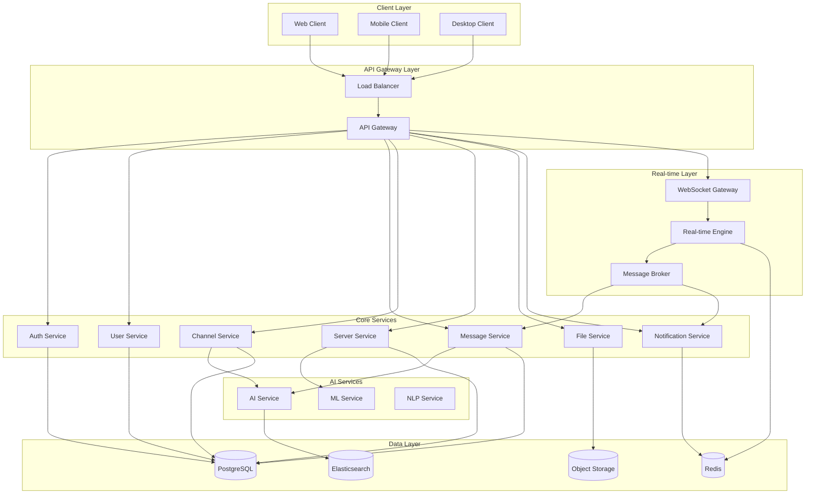

# System Architecture

## Overview

Enrichment follows a microservices architecture designed for scalability, maintainability, and real-time performance. The system is built with a focus on horizontal scaling, fault tolerance, and seamless integration of AI services.

## Architecture Principles

1. **Microservices**: Loosely coupled services with clear boundaries
2. **Event-Driven**: Asynchronous communication using message queues
3. **API-First**: RESTful APIs with GraphQL for complex queries
4. **Real-time**: WebSocket connections for instant communication
5. **Scalable**: Horizontal scaling with load balancing
6. **Resilient**: Circuit breakers and graceful degradation
7. **Observable**: Comprehensive logging, metrics, and tracing

## High-Level Architecture

## Service Breakdown

### Core Services

#### Authentication Service
- **Purpose**: User authentication, authorization, and session management
- **Technologies**: JWT tokens, OAuth2, bcrypt
- **Database**: PostgreSQL (users, sessions, permissions)
- **Cache**: Redis (session storage, rate limiting)

#### User Service
- **Purpose**: User profile management, preferences, and relationships
- **Technologies**: Node.js, Express, TypeScript
- **Database**: PostgreSQL (profiles, settings, friendships)
- **Features**: Profile management, friend systems, privacy settings

#### Message Service
- **Purpose**: Message creation, storage, and retrieval
- **Technologies**: Node.js, Socket.io, TypeScript
- **Database**: PostgreSQL (messages, threads, reactions)
- **Cache**: Redis (recent messages, typing indicators)
- **Features**: Text/media messages, threads, reactions, editing

#### Channel Service
- **Purpose**: Channel management, permissions, and organization
- **Technologies**: Node.js, Express, TypeScript
- **Database**: PostgreSQL (channels, categories, permissions)
- **Features**: Text/voice channels, categories, permission overrides

#### Server Service
- **Purpose**: Server/guild management and community features
- **Technologies**: Node.js, Express, TypeScript
- **Database**: PostgreSQL (servers, roles, members, settings)
- **Features**: Server creation, role management, member management

#### File Service
- **Purpose**: File upload, processing, and delivery
- **Technologies**: Node.js, Sharp, FFmpeg
- **Storage**: AWS S3 or compatible object storage
- **Features**: Image/video processing, CDN integration, virus scanning

#### Notification Service
- **Purpose**: Push notifications and email delivery
- **Technologies**: Node.js, FCM, SendGrid
- **Database**: Redis (notification queues, preferences)
- **Features**: Real-time notifications, email notifications, preferences

### AI Services

#### AI Service
- **Purpose**: AI-powered features coordination
- **Technologies**: Python, FastAPI, OpenAI API
- **Features**: Content moderation, sentiment analysis, smart replies

#### ML Service
- **Purpose**: Custom machine learning models
- **Technologies**: Python, TensorFlow/PyTorch, scikit-learn
- **Features**: Spam detection, user behavior analysis, recommendation engine

#### NLP Service
- **Purpose**: Natural language processing
- **Technologies**: Python, spaCy, Transformers
- **Features**: Language detection, content summarization, search indexing

### Infrastructure Services

#### API Gateway
- **Purpose**: Request routing, authentication, rate limiting
- **Technologies**: Kong, Nginx, or AWS API Gateway
- **Features**: Load balancing, SSL termination, request/response transformation

#### WebSocket Gateway
- **Purpose**: Real-time communication management
- **Technologies**: Node.js, Socket.io, Redis adapter
- **Features**: Connection management, room management, message broadcasting

#### Message Broker
- **Purpose**: Asynchronous communication between services
- **Technologies**: Redis Pub/Sub or Apache Kafka
- **Features**: Event publishing, message queuing, dead letter queues

## Data Architecture

### Primary Database (PostgreSQL)
- **Users and Authentication**: User accounts, sessions, permissions
- **Content**: Messages, channels, servers, files metadata
- **Relationships**: Friendships, server memberships, channel subscriptions
- **Configuration**: Server settings, user preferences, role definitions

### Cache Layer (Redis)
- **Session Storage**: Active user sessions and JWT tokens
- **Real-time Data**: Online users, typing indicators, presence
- **Message Cache**: Recent messages for fast retrieval
- **Rate Limiting**: API rate limits and abuse prevention

### Search Engine (Elasticsearch)
- **Message Search**: Full-text search across all messages
- **User Search**: User and server discovery
- **Content Indexing**: AI-enhanced content categorization
- **Analytics**: Search analytics and user behavior tracking

### Object Storage (S3-compatible)
- **File Storage**: Images, videos, documents, voice messages
- **Backup Storage**: Database backups and logs
- **Static Assets**: Client application assets and CDN content

## Scalability Considerations

### Horizontal Scaling
- **Stateless Services**: All services designed to be stateless
- **Load Balancing**: Round-robin and least-connections algorithms
- **Database Sharding**: Partition data by server/guild ID
- **Cache Distribution**: Redis cluster for distributed caching

### Performance Optimization
- **Connection Pooling**: Database and Redis connection pools
- **CDN Integration**: Global content delivery for static assets
- **Compression**: Gzip/Brotli compression for API responses
- **Lazy Loading**: Progressive data loading in clients

### Fault Tolerance
- **Circuit Breakers**: Prevent cascade failures
- **Retry Logic**: Exponential backoff for failed requests
- **Health Checks**: Service health monitoring and auto-recovery
- **Graceful Degradation**: Fallback modes for service failures

## Security Architecture

### Authentication & Authorization
- **Multi-factor Authentication**: TOTP and SMS-based 2FA
- **Role-based Access Control**: Granular permissions system
- **API Security**: Rate limiting, input validation, CORS
- **Session Management**: Secure session handling and rotation

### Data Protection
- **Encryption**: TLS 1.3 for transport, AES-256 for data at rest
- **Data Anonymization**: PII protection and GDPR compliance
- **Audit Logging**: Comprehensive security event logging
- **Vulnerability Scanning**: Regular security assessments

## Monitoring & Observability

### Metrics Collection
- **Application Metrics**: Custom business metrics
- **Infrastructure Metrics**: CPU, memory, network, disk usage
- **Database Metrics**: Query performance, connection pools
- **Real-time Metrics**: WebSocket connections, message throughput

### Logging Strategy
- **Structured Logging**: JSON-formatted logs with correlation IDs
- **Centralized Logging**: ELK stack for log aggregation
- **Log Levels**: Appropriate log levels for different environments
- **Sensitive Data**: Redaction of PII and sensitive information

### Distributed Tracing
- **Request Tracing**: End-to-end request tracking
- **Performance Monitoring**: Identify bottlenecks and slow queries
- **Error Tracking**: Comprehensive error reporting and alerting
- **Service Dependencies**: Visualize service interaction patterns
