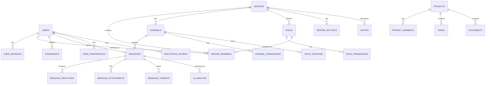

# Database Schema Design

## Overview

The Enrichment platform uses PostgreSQL as the primary database with Redis for caching and Elasticsearch for search functionality. The schema is designed for scalability, performance, and data integrity while supporting both Discord-compatible features and innovative enhancements.

## Database Design Principles

1. **Normalization**: Proper normalization to reduce data redundancy
2. **Indexing**: Strategic indexing for query performance
3. **Constraints**: Foreign keys and check constraints for data integrity
4. **Partitioning**: Table partitioning for large datasets (messages)
5. **Audit Trail**: Soft deletes and audit logs for data history
6. **Scalability**: Design for horizontal scaling and sharding

## Core Entity Relationship Diagram



## Core Tables

### Users and Authentication

```sql
-- Users table
CREATE TABLE users (
    id UUID PRIMARY KEY DEFAULT gen_random_uuid(),
    username VARCHAR(32) NOT NULL UNIQUE,
    email VARCHAR(255) NOT NULL UNIQUE,
    password_hash VARCHAR(255) NOT NULL,
    display_name VARCHAR(100),
    avatar_url VARCHAR(500),
    banner_url VARCHAR(500),
    bio TEXT,
    status VARCHAR(20) DEFAULT 'offline' CHECK (status IN ('online', 'idle', 'dnd', 'offline')),
    custom_status VARCHAR(128),
    verified BOOLEAN DEFAULT FALSE,
    bot BOOLEAN DEFAULT FALSE,
    system BOOLEAN DEFAULT FALSE,
    mfa_enabled BOOLEAN DEFAULT FALSE,
    locale VARCHAR(10) DEFAULT 'en-US',
    flags INTEGER DEFAULT 0,
    premium_type INTEGER DEFAULT 0,
    public_flags INTEGER DEFAULT 0,
    created_at TIMESTAMP WITH TIME ZONE DEFAULT NOW(),
    updated_at TIMESTAMP WITH TIME ZONE DEFAULT NOW(),
    deleted_at TIMESTAMP WITH TIME ZONE
);

-- User sessions
CREATE TABLE user_sessions (
    id UUID PRIMARY KEY DEFAULT gen_random_uuid(),
    user_id UUID NOT NULL REFERENCES users(id) ON DELETE CASCADE,
    token_hash VARCHAR(255) NOT NULL,
    refresh_token_hash VARCHAR(255),
    device_info JSONB,
    ip_address INET,
    user_agent TEXT,
    expires_at TIMESTAMP WITH TIME ZONE NOT NULL,
    created_at TIMESTAMP WITH TIME ZONE DEFAULT NOW(),
    last_used_at TIMESTAMP WITH TIME ZONE DEFAULT NOW()
);

-- User preferences
CREATE TABLE user_preferences (
    user_id UUID PRIMARY KEY REFERENCES users(id) ON DELETE CASCADE,
    theme VARCHAR(20) DEFAULT 'dark',
    language VARCHAR(10) DEFAULT 'en-US',
    timezone VARCHAR(50) DEFAULT 'UTC',
    notifications JSONB DEFAULT '{}',
    privacy JSONB DEFAULT '{}',
    accessibility JSONB DEFAULT '{}',
    created_at TIMESTAMP WITH TIME ZONE DEFAULT NOW(),
    updated_at TIMESTAMP WITH TIME ZONE DEFAULT NOW()
);
```

### Servers and Communities

```sql
-- Servers (Guilds)
CREATE TABLE servers (
    id UUID PRIMARY KEY DEFAULT gen_random_uuid(),
    name VARCHAR(100) NOT NULL,
    description TEXT,
    icon_url VARCHAR(500),
    banner_url VARCHAR(500),
    splash_url VARCHAR(500),
    owner_id UUID NOT NULL REFERENCES users(id),
    region VARCHAR(20) DEFAULT 'us-east',
    afk_channel_id UUID,
    afk_timeout INTEGER DEFAULT 300,
    verification_level INTEGER DEFAULT 0,
    default_message_notifications INTEGER DEFAULT 0,
    explicit_content_filter INTEGER DEFAULT 0,
    features TEXT[] DEFAULT '{}',
    mfa_level INTEGER DEFAULT 0,
    system_channel_id UUID,
    system_channel_flags INTEGER DEFAULT 0,
    rules_channel_id UUID,
    public_updates_channel_id UUID,
    preferred_locale VARCHAR(10) DEFAULT 'en-US',
    premium_tier INTEGER DEFAULT 0,
    premium_subscription_count INTEGER DEFAULT 0,
    vanity_url_code VARCHAR(50) UNIQUE,
    member_count INTEGER DEFAULT 0,
    max_members INTEGER DEFAULT 500000,
    max_presences INTEGER,
    nsfw BOOLEAN DEFAULT FALSE,
    created_at TIMESTAMP WITH TIME ZONE DEFAULT NOW(),
    updated_at TIMESTAMP WITH TIME ZONE DEFAULT NOW(),
    deleted_at TIMESTAMP WITH TIME ZONE
);

-- Server members
CREATE TABLE server_members (
    id UUID PRIMARY KEY DEFAULT gen_random_uuid(),
    server_id UUID NOT NULL REFERENCES servers(id) ON DELETE CASCADE,
    user_id UUID NOT NULL REFERENCES users(id) ON DELETE CASCADE,
    nickname VARCHAR(32),
    joined_at TIMESTAMP WITH TIME ZONE DEFAULT NOW(),
    premium_since TIMESTAMP WITH TIME ZONE,
    deaf BOOLEAN DEFAULT FALSE,
    mute BOOLEAN DEFAULT FALSE,
    pending BOOLEAN DEFAULT FALSE,
    permissions BIGINT,
    communication_disabled_until TIMESTAMP WITH TIME ZONE,
    created_at TIMESTAMP WITH TIME ZONE DEFAULT NOW(),
    updated_at TIMESTAMP WITH TIME ZONE DEFAULT NOW(),
    UNIQUE(server_id, user_id)
);

-- Roles
CREATE TABLE roles (
    id UUID PRIMARY KEY DEFAULT gen_random_uuid(),
    server_id UUID NOT NULL REFERENCES servers(id) ON DELETE CASCADE,
    name VARCHAR(100) NOT NULL,
    color INTEGER DEFAULT 0,
    hoist BOOLEAN DEFAULT FALSE,
    icon_url VARCHAR(500),
    unicode_emoji VARCHAR(100),
    position INTEGER NOT NULL DEFAULT 0,
    permissions BIGINT DEFAULT 0,
    managed BOOLEAN DEFAULT FALSE,
    mentionable BOOLEAN DEFAULT FALSE,
    created_at TIMESTAMP WITH TIME ZONE DEFAULT NOW(),
    updated_at TIMESTAMP WITH TIME ZONE DEFAULT NOW()
);

-- Member roles (many-to-many)
CREATE TABLE member_roles (
    member_id UUID NOT NULL REFERENCES server_members(id) ON DELETE CASCADE,
    role_id UUID NOT NULL REFERENCES roles(id) ON DELETE CASCADE,
    assigned_at TIMESTAMP WITH TIME ZONE DEFAULT NOW(),
    assigned_by UUID REFERENCES users(id),
    PRIMARY KEY (member_id, role_id)
);
```

### Channels and Communication

```sql
-- Channels
CREATE TABLE channels (
    id UUID PRIMARY KEY DEFAULT gen_random_uuid(),
    server_id UUID REFERENCES servers(id) ON DELETE CASCADE,
    parent_id UUID REFERENCES channels(id) ON DELETE SET NULL,
    type INTEGER NOT NULL DEFAULT 0, -- 0: text, 1: dm, 2: voice, 3: group_dm, 4: category, etc.
    name VARCHAR(100),
    topic TEXT,
    position INTEGER DEFAULT 0,
    nsfw BOOLEAN DEFAULT FALSE,
    rate_limit_per_user INTEGER DEFAULT 0,
    bitrate INTEGER,
    user_limit INTEGER,
    rtc_region VARCHAR(20),
    video_quality_mode INTEGER DEFAULT 1,
    default_auto_archive_duration INTEGER,
    permissions JSONB DEFAULT '[]',
    last_message_id UUID,
    last_pin_timestamp TIMESTAMP WITH TIME ZONE,
    created_at TIMESTAMP WITH TIME ZONE DEFAULT NOW(),
    updated_at TIMESTAMP WITH TIME ZONE DEFAULT NOW(),
    deleted_at TIMESTAMP WITH TIME ZONE
);

-- Channel permissions (overrides)
CREATE TABLE channel_permissions (
    id UUID PRIMARY KEY DEFAULT gen_random_uuid(),
    channel_id UUID NOT NULL REFERENCES channels(id) ON DELETE CASCADE,
    target_id UUID NOT NULL, -- user_id or role_id
    target_type VARCHAR(10) NOT NULL CHECK (target_type IN ('user', 'role')),
    allow BIGINT DEFAULT 0,
    deny BIGINT DEFAULT 0,
    created_at TIMESTAMP WITH TIME ZONE DEFAULT NOW()
);
```

### Messages and Content

```sql
-- Messages (partitioned by created_at)
CREATE TABLE messages (
    id UUID PRIMARY KEY DEFAULT gen_random_uuid(),
    channel_id UUID NOT NULL REFERENCES channels(id) ON DELETE CASCADE,
    author_id UUID NOT NULL REFERENCES users(id),
    content TEXT,
    timestamp TIMESTAMP WITH TIME ZONE DEFAULT NOW(),
    edited_timestamp TIMESTAMP WITH TIME ZONE,
    tts BOOLEAN DEFAULT FALSE,
    mention_everyone BOOLEAN DEFAULT FALSE,
    mentions UUID[] DEFAULT '{}',
    mention_roles UUID[] DEFAULT '{}',
    mention_channels UUID[] DEFAULT '{}',
    attachments JSONB DEFAULT '[]',
    embeds JSONB DEFAULT '[]',
    reactions JSONB DEFAULT '[]',
    nonce VARCHAR(255),
    pinned BOOLEAN DEFAULT FALSE,
    webhook_id UUID,
    type INTEGER DEFAULT 0,
    activity JSONB,
    application JSONB,
    application_id UUID,
    message_reference JSONB,
    flags INTEGER DEFAULT 0,
    referenced_message_id UUID REFERENCES messages(id),
    thread_id UUID,
    components JSONB DEFAULT '[]',
    sticker_items JSONB DEFAULT '[]',
    created_at TIMESTAMP WITH TIME ZONE DEFAULT NOW(),
    updated_at TIMESTAMP WITH TIME ZONE DEFAULT NOW(),
    deleted_at TIMESTAMP WITH TIME ZONE
) PARTITION BY RANGE (created_at);

-- Message partitions (monthly)
CREATE TABLE messages_2024_01 PARTITION OF messages
    FOR VALUES FROM ('2024-01-01') TO ('2024-02-01');

-- Message reactions
CREATE TABLE message_reactions (
    id UUID PRIMARY KEY DEFAULT gen_random_uuid(),
    message_id UUID NOT NULL REFERENCES messages(id) ON DELETE CASCADE,
    user_id UUID NOT NULL REFERENCES users(id) ON DELETE CASCADE,
    emoji_id UUID,
    emoji_name VARCHAR(100),
    emoji_animated BOOLEAN DEFAULT FALSE,
    created_at TIMESTAMP WITH TIME ZONE DEFAULT NOW(),
    UNIQUE(message_id, user_id, emoji_id, emoji_name)
);

-- Message attachments
CREATE TABLE message_attachments (
    id UUID PRIMARY KEY DEFAULT gen_random_uuid(),
    message_id UUID NOT NULL REFERENCES messages(id) ON DELETE CASCADE,
    filename VARCHAR(255) NOT NULL,
    description TEXT,
    content_type VARCHAR(100),
    size INTEGER NOT NULL,
    url VARCHAR(500) NOT NULL,
    proxy_url VARCHAR(500),
    height INTEGER,
    width INTEGER,
    ephemeral BOOLEAN DEFAULT FALSE,
    created_at TIMESTAMP WITH TIME ZONE DEFAULT NOW()
);
```

## Enhanced Features Tables

### AI and Intelligence

```sql
-- AI analysis of messages
CREATE TABLE ai_analysis (
    id UUID PRIMARY KEY DEFAULT gen_random_uuid(),
    message_id UUID NOT NULL REFERENCES messages(id) ON DELETE CASCADE,
    sentiment_score DECIMAL(3,2), -- -1.0 to 1.0
    toxicity_score DECIMAL(3,2),  -- 0.0 to 1.0
    language_code VARCHAR(10),
    topics TEXT[],
    entities JSONB,
    summary TEXT,
    confidence_score DECIMAL(3,2),
    model_version VARCHAR(50),
    created_at TIMESTAMP WITH TIME ZONE DEFAULT NOW()
);

-- Conversation summaries
CREATE TABLE conversation_summaries (
    id UUID PRIMARY KEY DEFAULT gen_random_uuid(),
    channel_id UUID NOT NULL REFERENCES channels(id) ON DELETE CASCADE,
    start_message_id UUID NOT NULL REFERENCES messages(id),
    end_message_id UUID NOT NULL REFERENCES messages(id),
    summary TEXT NOT NULL,
    key_points TEXT[],
    participants UUID[],
    message_count INTEGER,
    created_at TIMESTAMP WITH TIME ZONE DEFAULT NOW()
);
```

### Reputation and Community

```sql
-- User reputation scores
CREATE TABLE reputation_scores (
    id UUID PRIMARY KEY DEFAULT gen_random_uuid(),
    user_id UUID NOT NULL REFERENCES users(id) ON DELETE CASCADE,
    server_id UUID REFERENCES servers(id) ON DELETE CASCADE,
    score INTEGER DEFAULT 0,
    helpful_messages INTEGER DEFAULT 0,
    quality_contributions INTEGER DEFAULT 0,
    community_engagement INTEGER DEFAULT 0,
    moderation_actions INTEGER DEFAULT 0,
    last_calculated TIMESTAMP WITH TIME ZONE DEFAULT NOW(),
    created_at TIMESTAMP WITH TIME ZONE DEFAULT NOW(),
    updated_at TIMESTAMP WITH TIME ZONE DEFAULT NOW(),
    UNIQUE(user_id, server_id)
);

-- Community health metrics
CREATE TABLE community_health (
    id UUID PRIMARY KEY DEFAULT gen_random_uuid(),
    server_id UUID NOT NULL REFERENCES servers(id) ON DELETE CASCADE,
    date DATE NOT NULL,
    active_users INTEGER DEFAULT 0,
    message_count INTEGER DEFAULT 0,
    positive_sentiment_ratio DECIMAL(3,2),
    toxicity_incidents INTEGER DEFAULT 0,
    moderation_actions INTEGER DEFAULT 0,
    engagement_score DECIMAL(5,2),
    health_score DECIMAL(3,2), -- 0.0 to 1.0
    created_at TIMESTAMP WITH TIME ZONE DEFAULT NOW(),
    UNIQUE(server_id, date)
);
```

## Indexes and Performance

```sql
-- Critical indexes for performance
CREATE INDEX idx_users_username ON users(username);
CREATE INDEX idx_users_email ON users(email);
CREATE INDEX idx_users_created_at ON users(created_at);

CREATE INDEX idx_servers_owner_id ON servers(owner_id);
CREATE INDEX idx_servers_created_at ON servers(created_at);

CREATE INDEX idx_server_members_server_id ON server_members(server_id);
CREATE INDEX idx_server_members_user_id ON server_members(user_id);
CREATE INDEX idx_server_members_joined_at ON server_members(joined_at);

CREATE INDEX idx_channels_server_id ON channels(server_id);
CREATE INDEX idx_channels_parent_id ON channels(parent_id);
CREATE INDEX idx_channels_type ON channels(type);

CREATE INDEX idx_messages_channel_id ON messages(channel_id);
CREATE INDEX idx_messages_author_id ON messages(author_id);
CREATE INDEX idx_messages_timestamp ON messages(timestamp);
CREATE INDEX idx_messages_content_gin ON messages USING gin(to_tsvector('english', content));

CREATE INDEX idx_message_reactions_message_id ON message_reactions(message_id);
CREATE INDEX idx_message_reactions_user_id ON message_reactions(user_id);

CREATE INDEX idx_ai_analysis_message_id ON ai_analysis(message_id);
CREATE INDEX idx_ai_analysis_sentiment ON ai_analysis(sentiment_score);
CREATE INDEX idx_ai_analysis_toxicity ON ai_analysis(toxicity_score);
```
