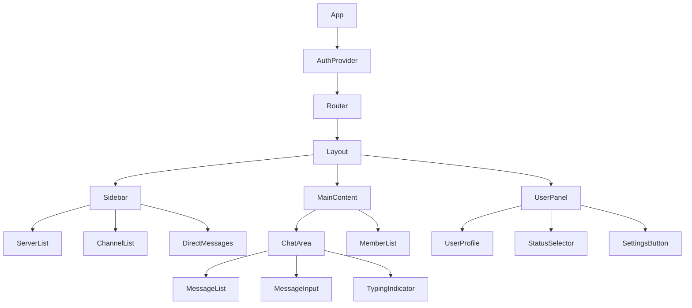

# Frontend Architecture

## Overview

The Enrichment frontend is built as a modern, responsive web application using React 18+ with TypeScript. The architecture emphasizes performance, maintainability, and user experience while supporting real-time communication and AI-powered features.

## Technology Stack

### Core Technologies
- **React 18+**: Component-based UI with concurrent features
- **TypeScript**: Type-safe development and better IDE support
- **Vite**: Fast build tool and development server
- **React Router**: Client-side routing and navigation
- **TailwindCSS**: Utility-first CSS framework
- **Framer Motion**: Smooth animations and transitions

### State Management
- **Zustand**: Lightweight state management for global state
- **React Query (TanStack Query)**: Server state management and caching
- **React Hook Form**: Form state management and validation
- **Immer**: Immutable state updates

### Real-time Communication
- **Socket.io Client**: WebSocket communication
- **React Query**: Real-time data synchronization
- **Custom hooks**: WebSocket event handling

### UI Components
- **Radix UI**: Accessible, unstyled UI primitives
- **Lucide React**: Icon library
- **React Virtual**: Virtualization for large lists
- **React Window**: Efficient rendering of large datasets

### Development Tools
- **ESLint**: Code linting and style enforcement
- **Prettier**: Code formatting
- **Husky**: Git hooks for quality assurance
- **Storybook**: Component development and documentation
- **Vitest**: Unit testing framework
- **Playwright**: End-to-end testing

## Project Structure

```
src/
├── components/           # Reusable UI components
│   ├── ui/              # Base UI components (buttons, inputs, etc.)
│   ├── layout/          # Layout components (sidebar, header, etc.)
│   ├── chat/            # Chat-specific components
│   ├── server/          # Server management components
│   └── modals/          # Modal dialogs
├── pages/               # Page components and routing
│   ├── auth/            # Authentication pages
│   ├── app/             # Main application pages
│   └── settings/        # Settings pages
├── hooks/               # Custom React hooks
│   ├── api/             # API-related hooks
│   ├── websocket/       # WebSocket hooks
│   └── utils/           # Utility hooks
├── stores/              # Zustand stores
│   ├── auth.ts          # Authentication state
│   ├── chat.ts          # Chat state
│   ├── ui.ts            # UI state
│   └── settings.ts      # User settings
├── services/            # API and external services
│   ├── api/             # REST API client
│   ├── websocket/       # WebSocket client
│   └── ai/              # AI service integration
├── utils/               # Utility functions
│   ├── constants.ts     # Application constants
│   ├── helpers.ts       # Helper functions
│   └── validation.ts    # Form validation schemas
├── types/               # TypeScript type definitions
│   ├── api.ts           # API response types
│   ├── websocket.ts     # WebSocket event types
│   └── common.ts        # Common types
└── assets/              # Static assets
    ├── images/          # Image files
    ├── icons/           # Icon files
    └── fonts/           # Font files
```

## Component Architecture

### Component Hierarchy



### Core Components

#### Layout Components

**AppLayout**
```typescript
interface AppLayoutProps {
  children: React.ReactNode;
}

const AppLayout: React.FC<AppLayoutProps> = ({ children }) => {
  return (
    <div className="flex h-screen bg-gray-900 text-white">
      <Sidebar />
      <main className="flex-1 flex flex-col">
        {children}
      </main>
      <UserPanel />
    </div>
  );
};
```

**Sidebar**
```typescript
const Sidebar: React.FC = () => {
  const { servers, activeServer } = useServerStore();
  const { channels } = useChannelStore();
  
  return (
    <div className="w-60 bg-gray-800 flex flex-col">
      <ServerHeader server={activeServer} />
      <ChannelList channels={channels} />
      <DirectMessagesList />
    </div>
  );
};
```

#### Chat Components

**MessageList**
```typescript
interface MessageListProps {
  channelId: string;
}

const MessageList: React.FC<MessageListProps> = ({ channelId }) => {
  const { data: messages, isLoading } = useMessages(channelId);
  const virtualizerRef = useRef<HTMLDivElement>(null);
  
  const rowVirtualizer = useVirtualizer({
    count: messages?.length ?? 0,
    getScrollElement: () => virtualizerRef.current,
    estimateSize: () => 60,
    overscan: 10,
  });
  
  return (
    <div ref={virtualizerRef} className="flex-1 overflow-auto">
      <div
        style={{
          height: `${rowVirtualizer.getTotalSize()}px`,
          width: '100%',
          position: 'relative',
        }}
      >
        {rowVirtualizer.getVirtualItems().map((virtualItem) => (
          <MessageItem
            key={virtualItem.key}
            message={messages[virtualItem.index]}
            style={{
              position: 'absolute',
              top: 0,
              left: 0,
              width: '100%',
              height: `${virtualItem.size}px`,
              transform: `translateY(${virtualItem.start}px)`,
            }}
          />
        ))}
      </div>
    </div>
  );
};
```

**MessageInput**
```typescript
const MessageInput: React.FC<{ channelId: string }> = ({ channelId }) => {
  const { register, handleSubmit, reset, watch } = useForm<MessageForm>();
  const sendMessage = useSendMessage();
  const { startTyping, stopTyping } = useTyping(channelId);
  
  const content = watch('content');
  
  useEffect(() => {
    if (content && content.length > 0) {
      startTyping();
    } else {
      stopTyping();
    }
  }, [content, startTyping, stopTyping]);
  
  const onSubmit = async (data: MessageForm) => {
    await sendMessage.mutateAsync({
      channelId,
      content: data.content,
    });
    reset();
    stopTyping();
  };
  
  return (
    <form onSubmit={handleSubmit(onSubmit)} className="p-4">
      <div className="flex items-center space-x-2">
        <input
          {...register('content', { required: true })}
          placeholder={`Message #${channelName}`}
          className="flex-1 bg-gray-700 rounded-lg px-4 py-2"
          autoComplete="off"
        />
        <button
          type="submit"
          disabled={sendMessage.isLoading}
          className="bg-blue-600 hover:bg-blue-700 px-4 py-2 rounded-lg"
        >
          Send
        </button>
      </div>
    </form>
  );
};
```

## State Management

### Zustand Stores

**Authentication Store**
```typescript
interface AuthState {
  user: User | null;
  token: string | null;
  isAuthenticated: boolean;
  login: (credentials: LoginCredentials) => Promise<void>;
  logout: () => void;
  refreshToken: () => Promise<void>;
}

export const useAuthStore = create<AuthState>((set, get) => ({
  user: null,
  token: localStorage.getItem('token'),
  isAuthenticated: false,
  
  login: async (credentials) => {
    const response = await authAPI.login(credentials);
    set({
      user: response.user,
      token: response.access_token,
      isAuthenticated: true,
    });
    localStorage.setItem('token', response.access_token);
  },
  
  logout: () => {
    set({ user: null, token: null, isAuthenticated: false });
    localStorage.removeItem('token');
  },
  
  refreshToken: async () => {
    const refreshToken = localStorage.getItem('refresh_token');
    if (!refreshToken) return;
    
    const response = await authAPI.refresh(refreshToken);
    set({ token: response.access_token });
    localStorage.setItem('token', response.access_token);
  },
}));
```

**Chat Store**
```typescript
interface ChatState {
  activeChannelId: string | null;
  activeServerId: string | null;
  typingUsers: Record<string, string[]>;
  setActiveChannel: (channelId: string) => void;
  setActiveServer: (serverId: string) => void;
  addTypingUser: (channelId: string, userId: string) => void;
  removeTypingUser: (channelId: string, userId: string) => void;
}

export const useChatStore = create<ChatState>((set) => ({
  activeChannelId: null,
  activeServerId: null,
  typingUsers: {},
  
  setActiveChannel: (channelId) => set({ activeChannelId: channelId }),
  setActiveServer: (serverId) => set({ activeServerId: serverId }),
  
  addTypingUser: (channelId, userId) =>
    set((state) => ({
      typingUsers: {
        ...state.typingUsers,
        [channelId]: [...(state.typingUsers[channelId] || []), userId],
      },
    })),
    
  removeTypingUser: (channelId, userId) =>
    set((state) => ({
      typingUsers: {
        ...state.typingUsers,
        [channelId]: (state.typingUsers[channelId] || []).filter(
          (id) => id !== userId
        ),
      },
    })),
}));
```

## Custom Hooks

### API Hooks

**useMessages**
```typescript
export const useMessages = (channelId: string) => {
  return useInfiniteQuery({
    queryKey: ['messages', channelId],
    queryFn: ({ pageParam = null }) =>
      messagesAPI.getMessages(channelId, { before: pageParam }),
    getNextPageParam: (lastPage) => lastPage.messages[0]?.id,
    enabled: !!channelId,
    refetchOnWindowFocus: false,
  });
};
```

**useSendMessage**
```typescript
export const useSendMessage = () => {
  const queryClient = useQueryClient();
  
  return useMutation({
    mutationFn: messagesAPI.sendMessage,
    onSuccess: (newMessage) => {
      queryClient.setQueryData(
        ['messages', newMessage.channel_id],
        (old: any) => {
          if (!old) return { pages: [{ messages: [newMessage] }] };
          
          const newPages = [...old.pages];
          newPages[newPages.length - 1] = {
            ...newPages[newPages.length - 1],
            messages: [...newPages[newPages.length - 1].messages, newMessage],
          };
          
          return { ...old, pages: newPages };
        }
      );
    },
  });
};
```

### WebSocket Hooks

**useWebSocket**
```typescript
export const useWebSocket = () => {
  const { token } = useAuthStore();
  const queryClient = useQueryClient();
  const [socket, setSocket] = useState<Socket | null>(null);
  
  useEffect(() => {
    if (!token) return;
    
    const newSocket = io(WS_URL, {
      auth: { token },
      transports: ['websocket'],
    });
    
    newSocket.on('message_create', (message: Message) => {
      queryClient.setQueryData(
        ['messages', message.channel_id],
        (old: any) => {
          if (!old) return { pages: [{ messages: [message] }] };
          
          const newPages = [...old.pages];
          newPages[newPages.length - 1] = {
            ...newPages[newPages.length - 1],
            messages: [...newPages[newPages.length - 1].messages, message],
          };
          
          return { ...old, pages: newPages };
        }
      );
    });
    
    newSocket.on('typing_start', ({ user_id, channel_id }) => {
      useChatStore.getState().addTypingUser(channel_id, user_id);
      
      setTimeout(() => {
        useChatStore.getState().removeTypingUser(channel_id, user_id);
      }, 3000);
    });
    
    setSocket(newSocket);
    
    return () => {
      newSocket.close();
    };
  }, [token, queryClient]);
  
  return socket;
};
```

## Performance Optimizations

### Code Splitting
```typescript
// Lazy load pages
const AuthPage = lazy(() => import('../pages/auth/AuthPage'));
const AppPage = lazy(() => import('../pages/app/AppPage'));
const SettingsPage = lazy(() => import('../pages/settings/SettingsPage'));

// Route-based code splitting
const AppRouter = () => (
  <Router>
    <Suspense fallback={<LoadingSpinner />}>
      <Routes>
        <Route path="/auth/*" element={<AuthPage />} />
        <Route path="/app/*" element={<AppPage />} />
        <Route path="/settings/*" element={<SettingsPage />} />
      </Routes>
    </Suspense>
  </Router>
);
```

### Virtualization
- **Message Lists**: Virtual scrolling for thousands of messages
- **Member Lists**: Efficient rendering of large member lists
- **Server Lists**: Virtualized server navigation

### Memoization
```typescript
// Memoize expensive calculations
const MessageItem = memo(({ message }: { message: Message }) => {
  const formattedTime = useMemo(
    () => formatMessageTime(message.timestamp),
    [message.timestamp]
  );
  
  const processedContent = useMemo(
    () => processMessageContent(message.content),
    [message.content]
  );
  
  return (
    <div className="message-item">
      <span className="timestamp">{formattedTime}</span>
      <div className="content">{processedContent}</div>
    </div>
  );
});
```

## Accessibility

### ARIA Support
- Proper ARIA labels and roles
- Keyboard navigation support
- Screen reader compatibility
- Focus management

### Keyboard Shortcuts
- `Ctrl/Cmd + K`: Quick switcher
- `Ctrl/Cmd + /`: Show keyboard shortcuts
- `Escape`: Close modals/menus
- `Tab`: Navigate through UI elements
- `Enter`: Send message/confirm action

## Testing Strategy

### Unit Tests
```typescript
// Component testing with React Testing Library
describe('MessageInput', () => {
  it('sends message on form submission', async () => {
    const mockSendMessage = jest.fn();
    render(<MessageInput channelId="123" onSendMessage={mockSendMessage} />);
    
    const input = screen.getByPlaceholderText(/message/i);
    const sendButton = screen.getByRole('button', { name: /send/i });
    
    await user.type(input, 'Hello world');
    await user.click(sendButton);
    
    expect(mockSendMessage).toHaveBeenCalledWith({
      content: 'Hello world',
      channelId: '123',
    });
  });
});
```

### Integration Tests
```typescript
// E2E testing with Playwright
test('user can send and receive messages', async ({ page }) => {
  await page.goto('/app');
  await page.fill('[data-testid="message-input"]', 'Hello world');
  await page.click('[data-testid="send-button"]');
  
  await expect(page.locator('[data-testid="message-list"]')).toContainText(
    'Hello world'
  );
});
```
